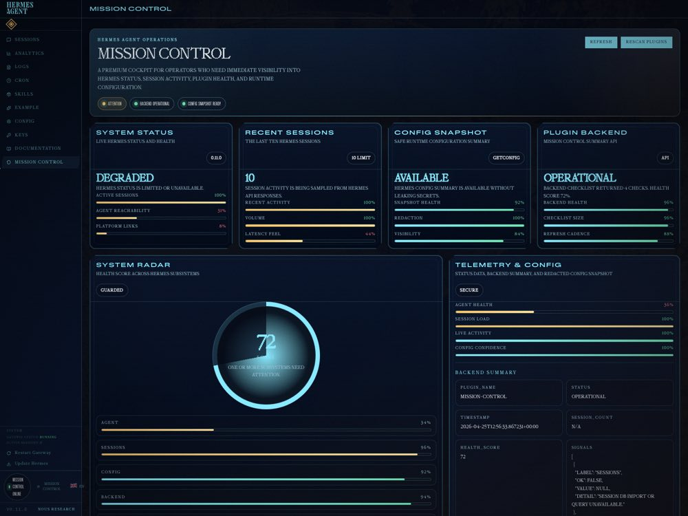
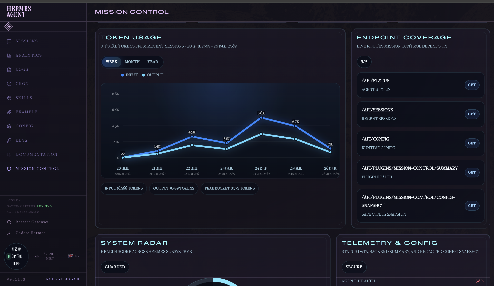
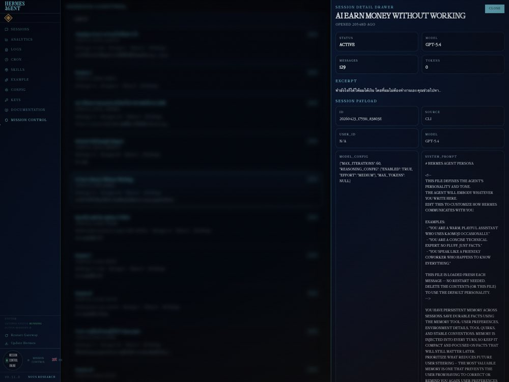
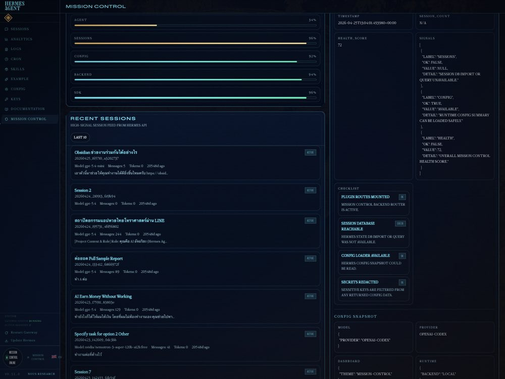
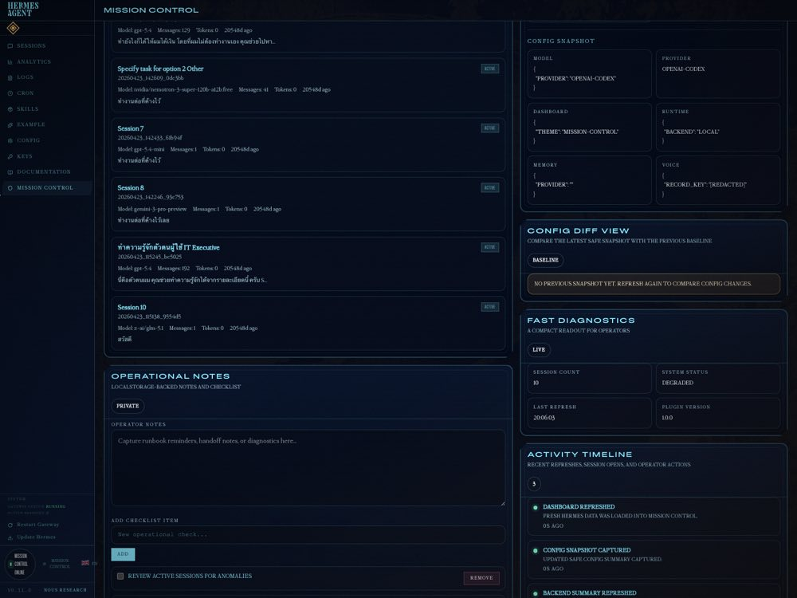

# Hermes Mission Control

Hermes Mission Control is a cockpit-style Hermes Dashboard plugin and matching theme for live agent operations.

It turns Hermes into a polished command center with live status, recent sessions, safe config visibility, plugin health controls, and operator notes.

## Preview











## Quick Start

Install the plugin and themes:

```bash
mkdir -p ~/.hermes/plugins/
cp -R plugin/mission-control ~/.hermes/plugins/

mkdir -p ~/.hermes/dashboard-themes/
cp theme/*.yaml ~/.hermes/dashboard-themes/

hermes dashboard
```

Then open `Mission Control`. If it does not appear immediately, rescan plugins:

```bash
curl http://127.0.0.1:9119/api/dashboard/plugins/rescan
```

## What It Does

- A dedicated `Mission Control` tab in Hermes Dashboard
- Sidebar telemetry with system status, session count, refresh time, and signal bars
- Recent sessions from `SDK.api.getSessions(10)`
- Live agent status from `SDK.api.getStatus()`
- Session detail drawer for inspecting one session at a time
- Health radar for a quick system readout
- Config diff view against the previous safe snapshot
- Activity timeline for refreshes, rescans, and operator actions
- LocalStorage-backed operator notes and checklist
- Safe config snapshot handling with redaction
- A rescan button that hits `/api/dashboard/plugins/rescan`
- A premium dark theme with scanlines, glow, and notched panels

## Included Themes

- `mission-control` - the original cockpit-style command center
- `paper-bloom` - warm ivory and blush with extra readability
- `sage-linen` - soft sage and linen with a calm editorial feel
- `pebble-sky` - cool stone and powder blue with crisp contrast
- `lavender-mist` - pale lilac and fog with a gentle minimal tone
- `butter-petal` - buttercream and peach with a friendly airy look

## Installation Notes

- Plugin structure: `plugin/mission-control/dashboard/manifest.json`, `dist/index.js`, `dist/style.css`, `plugin_api.py`
- Theme files: `theme/*.yaml`
- UI runtime: plain JavaScript IIFE, no JSX, no bundler, no React bundle
- SDK usage: `window.__HERMES_PLUGIN_SDK__`, `SDK.React`, `SDK.components`, `SDK.api`, `SDK.fetchJSON`
- Custom theme previews in the picker can show a dashed placeholder; the theme still applies normally

## Troubleshooting

- If the tab is missing, confirm the path is `~/.hermes/plugins/mission-control/dashboard/`
- If the theme is missing, confirm the path is `~/.hermes/dashboard-themes/mission-control.yaml`
- If you changed backend code, restart `hermes dashboard`
- If Hermes has no sessions yet, Mission Control will show an empty state instead of failing
- If Hermes internals are unavailable, the plugin falls back safely rather than crashing

## Screenshot Guidance

- Capture the `Mission Control` tab with the cockpit theme active
- Show the sidebar telemetry rail, session list, and notes/checklist panel
- Show the session detail drawer, health radar, config diff, and activity timeline if possible
- Include one shot of the refresh action and one of the plugin rescan action
- If possible, show the safe config snapshot panel to highlight redaction and reliability

## Submission Blurb

Hermes Mission Control turns Hermes Dashboard into an operator-grade cockpit. It combines a premium theme, live agent and session telemetry, secure config visibility, plugin health controls, and a practical notes/checklist surface into one polished drop-in experience.
